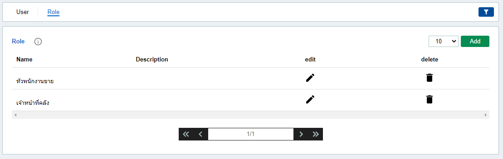

# **User Manual**

When you click tab **User**. 

1. tab **User**  

	When you click tab **User**.  

	

	- **Add User**
		1. Click <mark class="addButton">Add</mark> There will be a row to fill.

			

		2. If the information is correct, click <mark class="submitButton">Submit</mark>

		3. If you want to **cancel** click <mark class="clearButton">Cancel</mark> to close the form.
	
	 

	- **Edit User**
		1. Click 
			<svg class="svgWording" style="width:24px;height:24px" viewBox="0 0 24 24">
			<path fill="currentColor" d="M20.71,7.04C21.1,6.65 21.1,6 20.71,5.63L18.37,3.29C18,2.9 17.35,2.9 16.96,3.29L15.12,5.12L18.87,8.87M3,17.25V21H6.75L17.81,9.93L14.06,6.18L3,17.25Z"></path>
			</svg>
			to open the form.

			

		2. if finished edit click <mark class="submitButton">Submit</mark>

		3. If you want to **cancel** click <mark class="clearButton">Cancel</mark> to close the form.

	 

	- **Delete User**
		-  Click 
			<svg class="svgWording" style="width:24px;height:24px" viewBox="0 0 24 24">
			<path fill="currentColor" d="M19,4H15.5L14.5,3H9.5L8.5,4H5V6H19M6,19A2,2 0 0,0 8,21H16A2,2 0 0,0 18,19V7H6V19Z"></path>
			</svg>
			to delete unit.

			
			
			

			<svg  class="svgRemark" style="width:24px;height:24px;" viewBox="0 0 512  512 " >
			<path fill="currentColor" d="M256 8C119.043 8 8 119.083 8 256c0 136.997 111.043 248 248 248s248-111.003 248-248C504 119.083 392.957 8 256 8zm0 110c23.196 0 42 18.804 42 42s-18.804 42-42 42-42-18.804-42-42 18.804-42 42-42zm56 254c0 6.627-5.373 12-12 12h-88c-6.627 0-12-5.373-12-12v-24c0-6.627 5.373-12 12-12h12v-64h-12c-6.627 0-12-5.373-12-12v-24c0-6.627 5.373-12 12-12h64c6.627 0 12 5.373 12 12v100h12c6.627 0 12 5.373 12 12v24z"></path>
			</svg>
			<strong> remark: </strong> "stock" is gone
			

			
		 

	- **Filter a Unit**
		- Click 
			<svg class="svgFilter" style="width:24px;height:15px;" viewBox="0 0 24 24">
			<path fill="white" d="M14,12V19.88C14.04,20.18 13.94,20.5 13.71,20.71C13.32,21.1 12.69,21.1 12.3,20.71L10.29,18.7C10.06,18.47 9.96,18.16 10,17.87V12H9.97L4.21,4.62C3.87,4.19 3.95,3.56 4.38,3.22C4.57,3.08 4.78,3 5,3V3H19V3C19.22,3 19.43,3.08 19.62,3.22C20.05,3.56 20.13,4.19 19.79,4.62L14.03,12H14Z"></path>
			</svg>
			to open the form **Filter**.

			

			- Enter the information you want to filter and click  <mark class="submitButton">Submit</mark>

			- If you want to cancel or close, press  <mark class="clearButton">Clear</mark> 

		 

	 

1. tab **Role**

	When you click tab **Role**.  
	

	- **Add Role and Permission**

		1. Click <mark class="addButton">Add</mark> There will be a row to fill.

			

		2. If the information is correct, click <mark class="submitButton">Submit</mark>

		3. If you want to **cancel** click <mark class="clearButton">Cancel</mark> to close the form.

		 

	- **Edit Role and Permission**
		- Click
			<svg class="svgWording" style="width:24px;height:24px" viewBox="0 0 24 24">
			<path fill="currentColor" d="M20.71,7.04C21.1,6.65 21.1,6 20.71,5.63L18.37,3.29C18,2.9 17.35,2.9 16.96,3.29L15.12,5.12L18.87,8.87M3,17.25V21H6.75L17.81,9.93L14.06,6.18L3,17.25Z"></path>
			</svg>
			to open the form.

			

			- If the information is correct, click <mark class="submitButton">Submit</mark>

			- If you want to **cancel** click <mark class="clearButton">Cancel</mark> to close the form.

		 

	- **Delete Role and Permission**
		- Click
			<svg class="svgWording" style="width:24px;height:24px" viewBox="0 0 24 24">
			<path fill="currentColor" d="M19,4H15.5L14.5,3H9.5L8.5,4H5V6H19M6,19A2,2 0 0,0 8,21H16A2,2 0 0,0 18,19V7H6V19Z"></path>
			</svg>
			to delete role and permission.

			
			
			

			<svg  class="svgRemark" style="width:24px;height:24px;" viewBox="0 0 512  512 " >
			<path fill="currentColor" d="M256 8C119.043 8 8 119.083 8 256c0 136.997 111.043 248 248 248s248-111.003 248-248C504 119.083 392.957 8 256 8zm0 110c23.196 0 42 18.804 42 42s-18.804 42-42 42-42-18.804-42-42 18.804-42 42-42zm56 254c0 6.627-5.373 12-12 12h-88c-6.627 0-12-5.373-12-12v-24c0-6.627 5.373-12 12-12h12v-64h-12c-6.627 0-12-5.373-12-12v-24c0-6.627 5.373-12 12-12h64c6.627 0 12 5.373 12 12v100h12c6.627 0 12 5.373 12 12v24z"></path>
			</svg>
			<strong> remark: </strong> "หัวหน้าพนักงานขาย" is gone
			

			
		 

