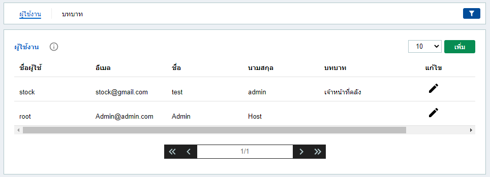
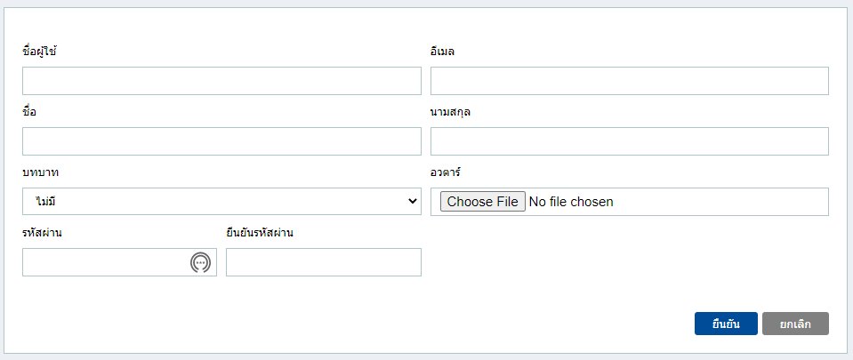
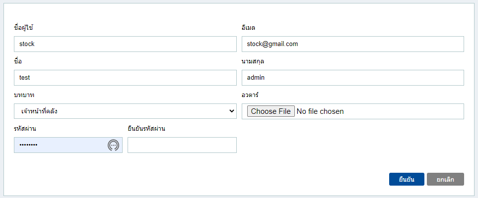
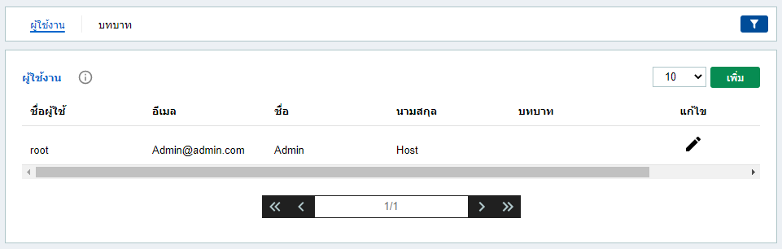
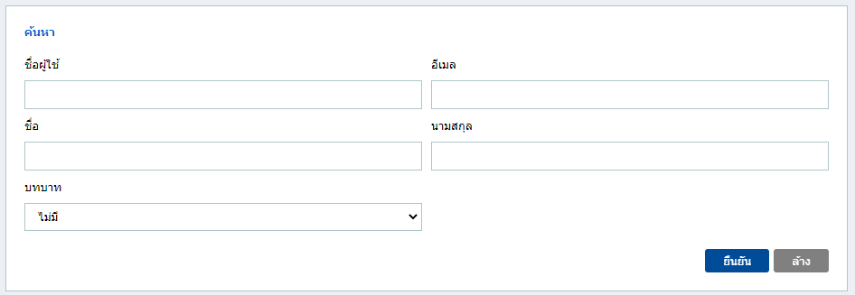
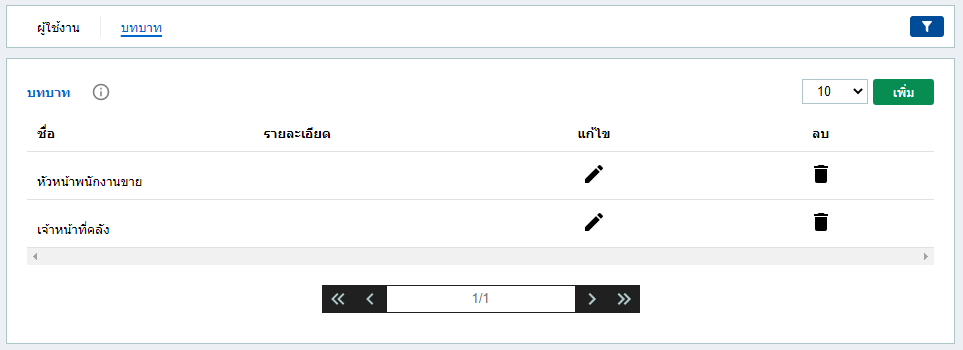
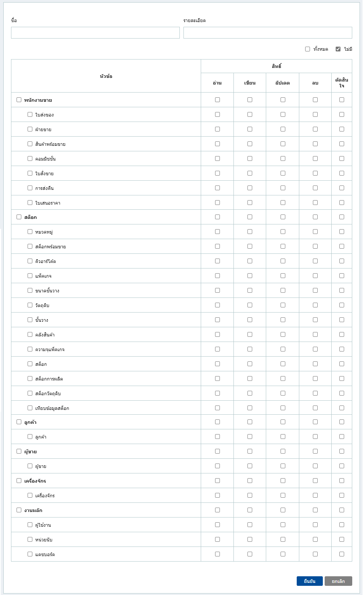
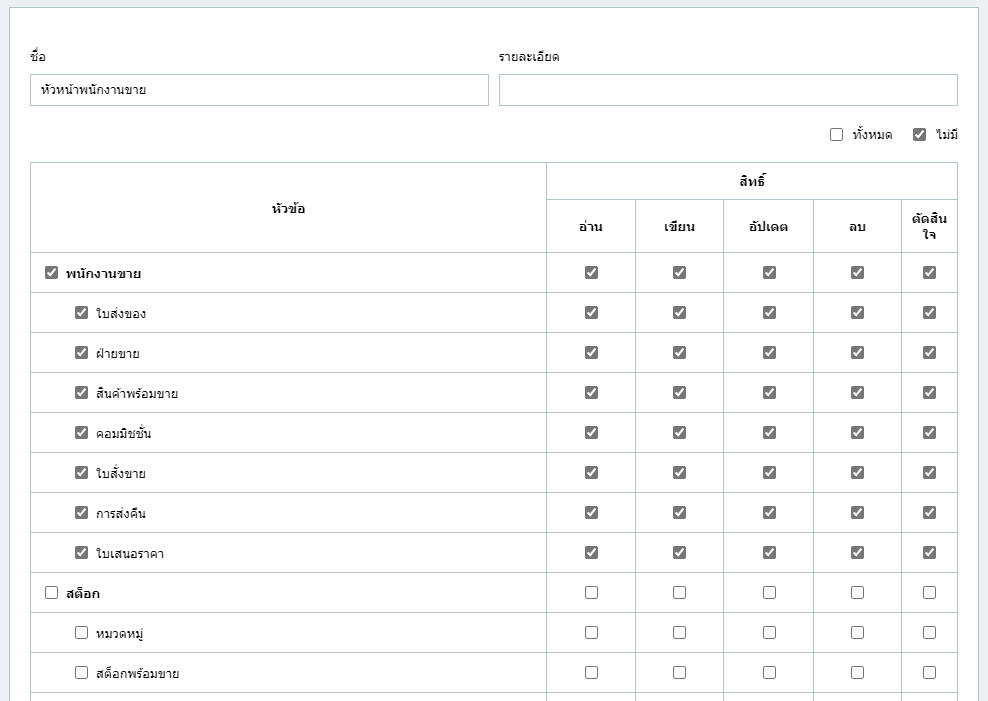
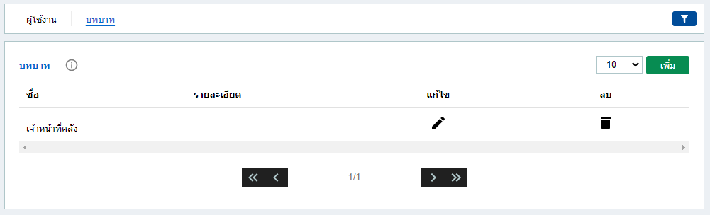

# **คู่มือการใช้งาน - ผู้ใช้งาน**

เมื่อคลิกแถบ **ผู้ใช้งาน** แถบด้านบนจะประกอบด้วย แถบ **" ผู้ใช้งาน "** และ **" บทบาท "**

1. แถบ **" ผู้ใช้งาน "**  

	เมื่อคลิกแถบ **ผู้ใช้งาน** ด้านบน จะเป็นแบบนี้  
	
	

	- **สร้างข้อมูล ผู้ใช้งาน**

		1. กดปุ่ม <mark class="addButton">เพิ่ม</mark> จะเปิดฟอร์มขึ้นมา  

			

		2. กรอกข้อมูลและตรวจสอบความถูกต้องแล้วให้กดปุ่ม <mark class="submitButton">ยืนยัน</mark>

		3. ถ้าต้องการ **ยกเลิก** ให้กดปุ่ม <mark class="clearButton">ยกเลิก</mark> เพื่อปิดฟอร์ม.

		 

	- **แก้ไขข้อมูล ผู้ใช้งาน**
		1. กดปุ่ม 
			<svg class="svgWording" style="width:24px;height:24px" viewBox="0 0 24 24">
			<path fill="currentColor" d="M20.71,7.04C21.1,6.65 21.1,6 20.71,5.63L18.37,3.29C18,2.9 17.35,2.9 16.96,3.29L15.12,5.12L18.87,8.87M3,17.25V21H6.75L17.81,9.93L14.06,6.18L3,17.25Z"></path>
			</svg>
			เพื่อเปิดฟอร์มขึ้นมาแก้ไข.

			

		2. ถ้าแก้ไขเสร็จแล้วให้กดปุ่ม <mark class="submitButton">ยืนยัน</mark>

		3. ถ้าต้องการจะ **ยกเลิก** ให้กดปุ่ม <mark class="clearButton">ยกเลิก</mark> เพื่อปิดฟอร์ม.

		 

	- **ลบข้อมูล ผู้ใช้งาน**
		- กดปุ่ม 
			<svg class="svgWording" style="width:24px;height:24px" viewBox="0 0 24 24">
			<path fill="currentColor" d="M19,4H15.5L14.5,3H9.5L8.5,4H5V6H19M6,19A2,2 0 0,0 8,21H16A2,2 0 0,0 18,19V7H6V19Z"></path>
			</svg>
			เพื่อลบข้อมูล

			
			
			

			<svg  class="svgRemark" style="width:24px;height:24px;" viewBox="0 0 512  512 " >
			<path fill="currentColor" d="M256 8C119.043 8 8 119.083 8 256c0 136.997 111.043 248 248 248s248-111.003 248-248C504 119.083 392.957 8 256 8zm0 110c23.196 0 42 18.804 42 42s-18.804 42-42 42-42-18.804-42-42 18.804-42 42-42zm56 254c0 6.627-5.373 12-12 12h-88c-6.627 0-12-5.373-12-12v-24c0-6.627 5.373-12 12-12h12v-64h-12c-6.627 0-12-5.373-12-12v-24c0-6.627 5.373-12 12-12h64c6.627 0 12 5.373 12 12v100h12c6.627 0 12 5.373 12 12v24z"></path>
			</svg>
			<strong> ข้อสังเกต: </strong> ข้อมูล "stock" ถูกลบไปแล้ว
			

		 

	- **ค้นหาข้อมูล ผู้ใช้งาน**
		- กดปุ่ม 
			<svg class="svgFilter" style="width:24px;height:15px;" viewBox="0 0 24 24">
			<path fill="white" d="M14,12V19.88C14.04,20.18 13.94,20.5 13.71,20.71C13.32,21.1 12.69,21.1 12.3,20.71L10.29,18.7C10.06,18.47 9.96,18.16 10,17.87V12H9.97L4.21,4.62C3.87,4.19 3.95,3.56 4.38,3.22C4.57,3.08 4.78,3 5,3V3H19V3C19.22,3 19.43,3.08 19.62,3.22C20.05,3.56 20.13,4.19 19.79,4.62L14.03,12H14Z"></path>
			</svg>
			เพื่อเปิดฟอร์ม **ค้นหา**.

			

			- ใส่ข้อมูลที่ต้องการค้นหา และกดปุ่ม <mark class="submitButton">ยืนยัน</mark>
			
			- ถ้าต้องการยกเลิกหรือปิด ให้กดปุ่ม <mark class="clearButton">ล้าง</mark> 

		 

	 

2. แถบ **" บทบาท "**

	เมื่อคลิกแถบ **บทบาท** ด้านบน จะเป็นแบบนี้  
	

	- **เพิ่ม บทบาท และ กำหนดสิทธิ ของบทบาท**

		1. กดปุ่ม <mark class="addButton">เพิ่ม</mark> จะเปิดฟอร์มขึ้นมา  

			

		2. กรอกข้อมูลและตรวจสอบความถูกต้องแล้วให้กดปุ่ม <mark class="submitButton">ยืนยัน</mark>

		3. ถ้าต้องการ **ยกเลิก** ให้กดปุ่ม <mark class="clearButton">ยกเลิก</mark> เพื่อปิดฟอร์ม.

		 

	- **แก้ไข บทบาท และ กำหนดสิทธิ ของบทบาท**
		- กดปุ่ม 
			<svg class="svgWording" style="width:24px;height:24px" viewBox="0 0 24 24">
			<path fill="currentColor" d="M20.71,7.04C21.1,6.65 21.1,6 20.71,5.63L18.37,3.29C18,2.9 17.35,2.9 16.96,3.29L15.12,5.12L18.87,8.87M3,17.25V21H6.75L17.81,9.93L14.06,6.18L3,17.25Z"></path>
			</svg>
			เพื่อเปิดฟอร์มขึ้นมาแก้ไข.

			

			- ถ้าแก้ไขเสร็จแล้วให้กดปุ่ม <mark class="submitButton">ยืนยัน</mark>

			- ถ้าต้องการจะ **ยกเลิก** ให้กดปุ่ม <mark class="clearButton">ยกเลิก</mark> เพื่อปิดฟอร์ม.

		 
	
	- **ลบบทบาท และ กำหนดสิทธิ ของบทบาท**
		- กดปุ่ม 
			<svg class="svgWording" style="width:24px;height:24px" viewBox="0 0 24 24">
			<path fill="currentColor" d="M19,4H15.5L14.5,3H9.5L8.5,4H5V6H19M6,19A2,2 0 0,0 8,21H16A2,2 0 0,0 18,19V7H6V19Z"></path>
			</svg>
			เพื่อลบข้อมูล

			
			
			

			<svg  class="svgRemark" style="width:24px;height:24px;" viewBox="0 0 512  512 " >
			<path fill="currentColor" d="M256 8C119.043 8 8 119.083 8 256c0 136.997 111.043 248 248 248s248-111.003 248-248C504 119.083 392.957 8 256 8zm0 110c23.196 0 42 18.804 42 42s-18.804 42-42 42-42-18.804-42-42 18.804-42 42-42zm56 254c0 6.627-5.373 12-12 12h-88c-6.627 0-12-5.373-12-12v-24c0-6.627 5.373-12 12-12h12v-64h-12c-6.627 0-12-5.373-12-12v-24c0-6.627 5.373-12 12-12h64c6.627 0 12 5.373 12 12v100h12c6.627 0 12 5.373 12 12v24z"></path>
			</svg>
			<strong> ข้อสังเกต: </strong> ข้อมูล "หัวหน้าพนักงานขาย" ถูกลบไปแล้ว
			

		 

